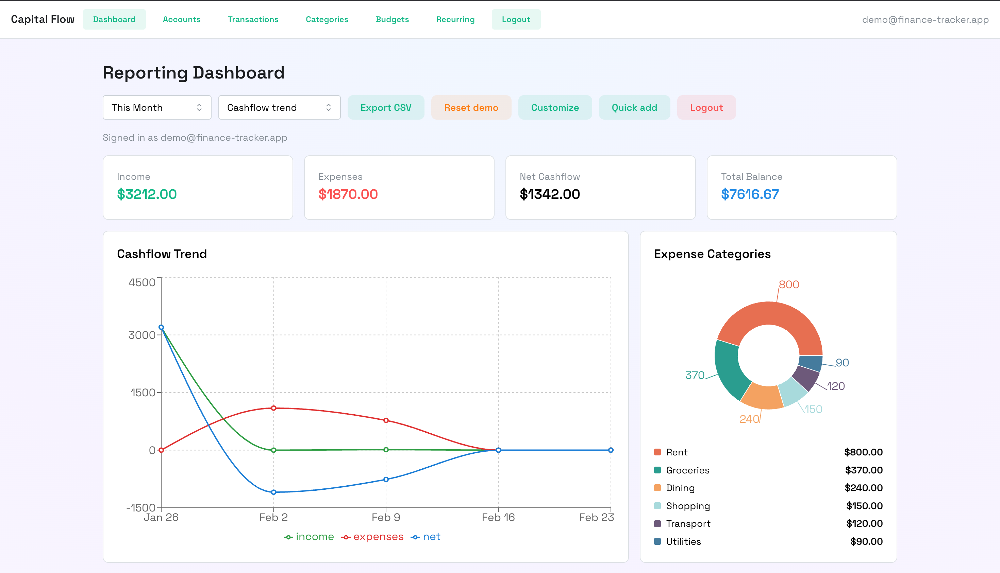

# Finance Tracker

Full‑stack personal finance tracker built to showcase production‑ready patterns: secure auth, async data access, caching, reporting, and CI/CD.



## Highlights (Recruiter‑Focused)
- **End‑to‑end product:** Auth → accounts → transactions → budgets → reporting
- **Production patterns:** session auth + CSRF, rate limiting, structured logging, Sentry
- **Performance mindset:** async DB access, Redis caching, report invalidation
- **Operational readiness:** health checks, migrations, CI on every PR
- **Data portability:** CSV import/export for transactions and reports

## What You Can Do
- Create accounts, categories, transactions (including splits, transfers, attachments)
- Build monthly budgets with rollover and templates
- Use rich reporting: cashflow trends, category breakdown, heatmap, top merchants
- Export datasets to CSV
- Explore via demo mode (seeded data + reset)

## Tech Stack
- **Backend:** FastAPI, async SQLAlchemy, Alembic, Redis, PostgreSQL
- **Frontend:** React, Vite, Mantine, Recharts
- **Infra/Deploy:** Docker Compose (local), Railway (prod)
- **CI:** GitHub Actions


## Architecture (Layered)
```
API (FastAPI)
  -> Services (business logic)
    -> Domain (rules + validation)
      -> Persistence (repositories, models)
```

## Local Development
1. Copy `.env.example` to `.env` and adjust values.
2. `make up`
3. `make test`
4. `make down`

## Services
- Backend: `http://localhost:8000`
- Frontend: `http://localhost:5173`
- Health: `GET /api/v1/health`

## Project Structure
- `backend/`: FastAPI + SQLAlchemy async + Alembic
- `frontend/`: Vite + React + Mantine
- `infra/`: docker‑compose
- `docs/`: planning and workflow
